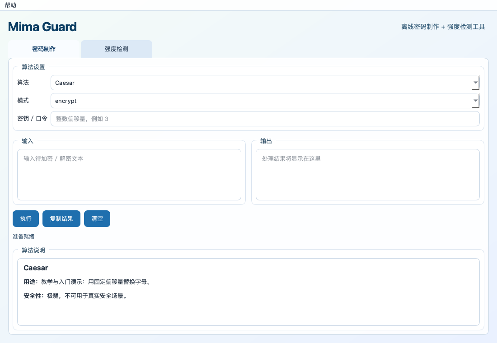
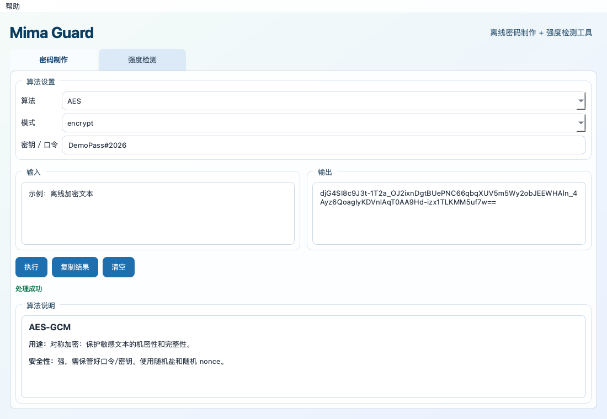
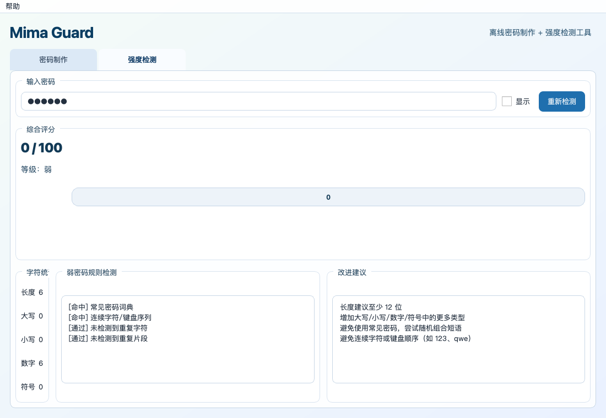
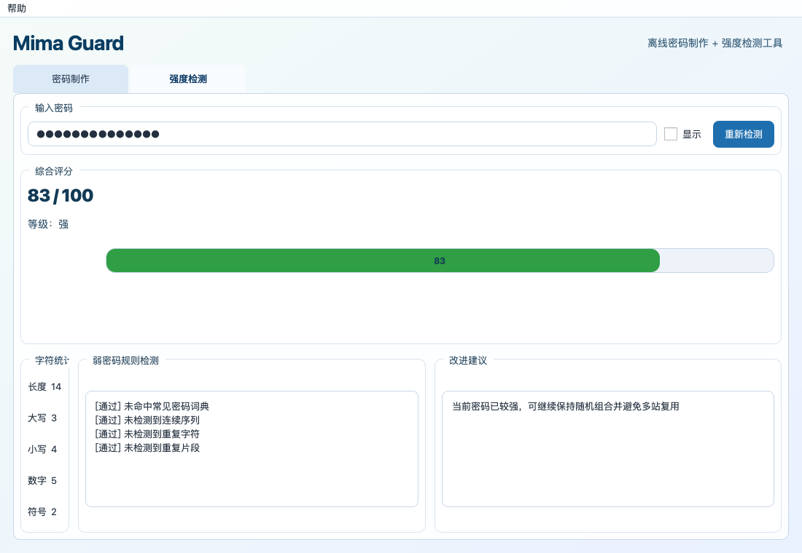

# 测试截图与兼容性报告

## 1. 功能测试结果

### 1.1 自动化单元测试

- 执行命令：`pytest -q`
- 结果：`8 passed`
- 覆盖点：
  - 凯撒加解密互通
  - 栅栏加解密互通
  - MD5/SHA-256 结果校验
  - 不可逆算法解密提示
  - AES 加解密互通
  - 强/弱密码评分及规则识别

### 1.2 功能截图（自动生成）

执行命令：`python scripts/generate_screenshots.py`

1. 密码制作模块总览

2. AES 加密执行结果

3. 强度检测-弱密码样例

4. 强度检测-强密码样例

### 1.3 操作演示视频（自动生成）

- 执行命令：`python scripts/generate_demo_video.py`
- 输出文件：`docs/videos/mima_demo.mp4`
- 文件大小：约 `3.4 MB`
- 视频时长：约 `28.8 秒`
- 覆盖内容：
  - 凯撒加密与解密
  - 栅栏加密与解密
  - MD5 摘要与复制结果
  - SHA-256 摘要与不可逆提示
  - AES 加密、复制结果与解密还原
  - 弱密码检测、显示密码、强密码检测

### 1.4 真人操作感演示视频（自动生成）

- 执行命令：`python scripts/generate_demo_video.py --style human`
- 输出文件：`docs/videos/mima_demo_human.mp4`
- 文件大小：约 `7.5 MB`
- 视频时长：约 `67.3 秒`
- 增强内容：
  - 放慢整体节奏，方便逐项讲解
  - 文本输入改为逐字动画
  - 增加模拟鼠标移动轨迹
  - 增加点击高亮涟漪效果

## 2. 兼容性测试

### 2.1 当前环境实测（已执行）

- 系统：macOS 13.7.8 (arm64)
- Python：3.9.6
- 依赖检查：`pip check` -> 无冲突
- 运行时兼容检查：`python scripts/compatibility_check.py` -> 全部 PASS
- 报告文件：`docs/compatibility_runtime_report.md`

### 2.2 打包链路验证（已执行）

- 执行命令：`pyinstaller --noconfirm --windowed --name MimaGuard run.py`
- 结果：打包成功
- 产物：
  - `dist/MimaGuard/`
  - `dist/MimaGuard.app`（当前环境为 macOS）

### 2.3 Windows 兼容性结论与复测步骤

结论：

- 项目代码与依赖均为跨平台实现，不依赖 macOS 专有 API；目标 Windows 单机离线运行可行。
- `PySide6 + cryptography + PyInstaller` 组合支持 Windows 10/11。

建议在 Windows 10/11 实机执行以下复测（同一套脚本）：

1. `pip install -r requirements.txt`
2. `python -m pytest -q`
3. `python scripts/compatibility_check.py`
4. `python scripts/generate_screenshots.py`
5. `pyinstaller --noconfirm --windowed --name MimaGuard run.py`

验收标准：

- 单元测试全部通过
- 兼容性检查报告全部 PASS
- 截图脚本生成 4 张功能截图
- 可执行文件可启动并完成 AES 加解密与强度检测
